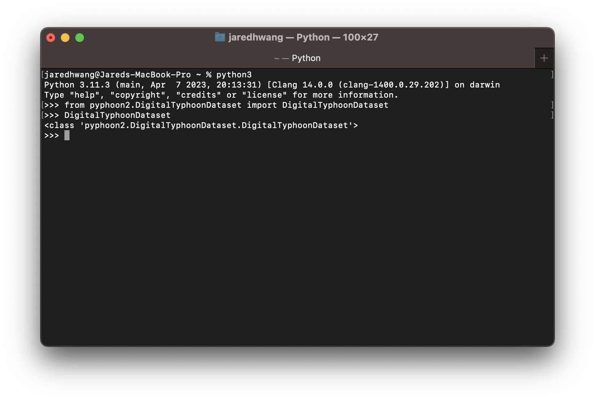

Installation
============

Prequisites
-----------

The following Python packages are required:

* torch
* torchvision
* numpy
* pandas
* h5py

Installation Steps 
------------------
1. Clone and enter the repo::
	
	git clone https://github.com/kitamoto-lab/pyphoon2
	cd pyphoon2

2. Run the following::

	pip3 install .

3. To uninstall, run::

	pip3 uninstall pyphoon2

Test the installation
---------------------

1. Open an interactive python session::

	python3

2. Import the package::

	from pyphoon2.DigitalTyphoonDataset import DigitalTyphoonDataset

If it successfully imported then the package has been installed. 

